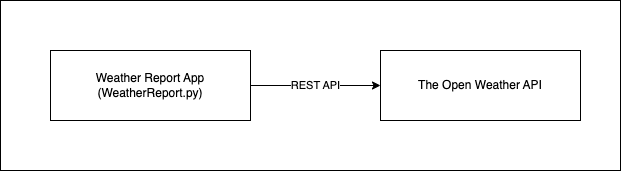

# Fastest-Coder-Hackathon

## Introduction

This repositorty contains solutions code generated for Fastest Code Hackathon.

## The Open Weather API

This program uses `openweathermap` service that provides weather data, including current weather data, forecasts, and historical data to the developers of web services and mobile applications. An API key can be obtained by signing up here: `https://openweathermap.org/price`. 

This project uses the `Free` plan that provides access to 5 day forecast for any location on the globe. It includes weather forecast data with 3-hour step. Forecast is available in JSON or XML format.

The `Call 5 day / 3 hour forecast data` API call template is in this format: `api.openweathermap.org/data/2.5/forecast?lat={lat}&lon={lon}&appid={API key}`

